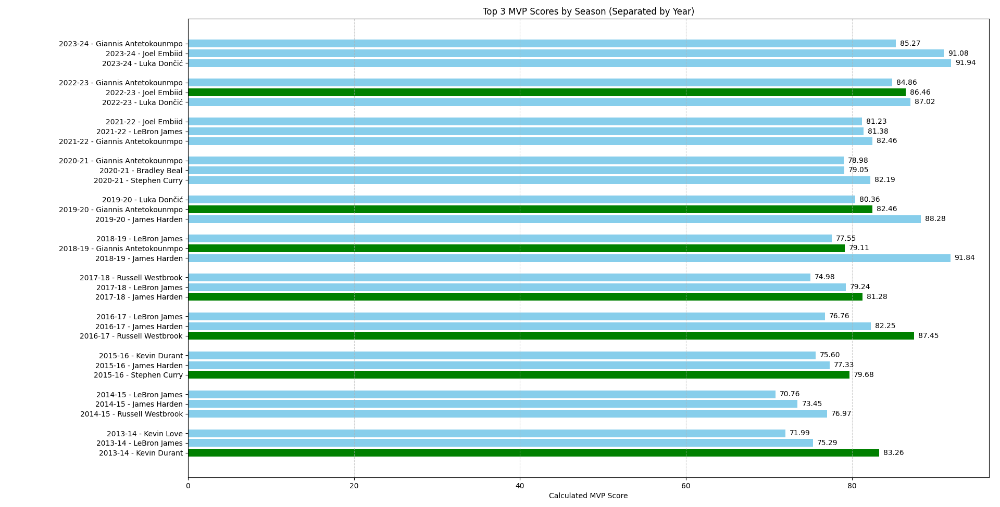

# 🏀 NBA MVP Predictor

This project analyzes NBA player performance across multiple seasons to identify the top 3 MVP candidates each year, based on a custom offensively-biased scoring formula. It emphasizes scoring efficiency, points per game, assists, and rebounds — and compares the model's picks against the actual MVP winners.

---

## 📊 MVP Formula

The MVP score is calculated using the following features:

```
MVP_SCORE = 
    (PTS per game × 2.0) +
    (AST per game × 1.0) +
    (REB per game × 0.5) +
    (FG efficiency × 20)
```

This formula favors offensive efficiency, placing the highest weight on points per game and shooting accuracy. Defensive stats are intentionally excluded.

---

## 📁 Project Structure

- `web_scrape.py`: Scrapes NBA player stats from [stats.nba.com](https://stats.nba.com) for seasons 2013–2024 and saves them to Excel.
- `nba_player_data.xlsx`: Dataset generated by the scraping script.
- `mvp.py`: Loads and processes the data, calculates MVP scores, and visualizes the top 3 MVPs per season alongside actual MVP winners.
- `mvp_graph.png`: Visualization output showing yearly top MVPs with true MVPs highlighted in green.

---

## 📷 Sample Output



Green bars indicate the actual MVP winner. Blue bars are the model's predicted top performers.

---

## 🚀 How to Run

1. **Scrape Data (Optional if using existing file):**

```bash
python web_scrape.py
```

2. **Run the MVP Analysis and Visualization:**

```bash
python mvp.py
```

---

## 📌 Notes

- The scraper introduces a random delay between requests to avoid rate-limiting.
- Only **regular season** stats are used in MVP calculations.
- Visualization is generated using `matplotlib`.

---

## 🤝 Contributing

Pull requests are welcome! If you'd like to improve the formula, add new metrics, or extend the scope to include playoff performance or defensive stats, feel free to fork and submit.

---

## 🙌 Acknowledgments

- Data from [stats.nba.com](https://stats.nba.com)
- Built using Python, Pandas, NumPy, and Matplotlib
